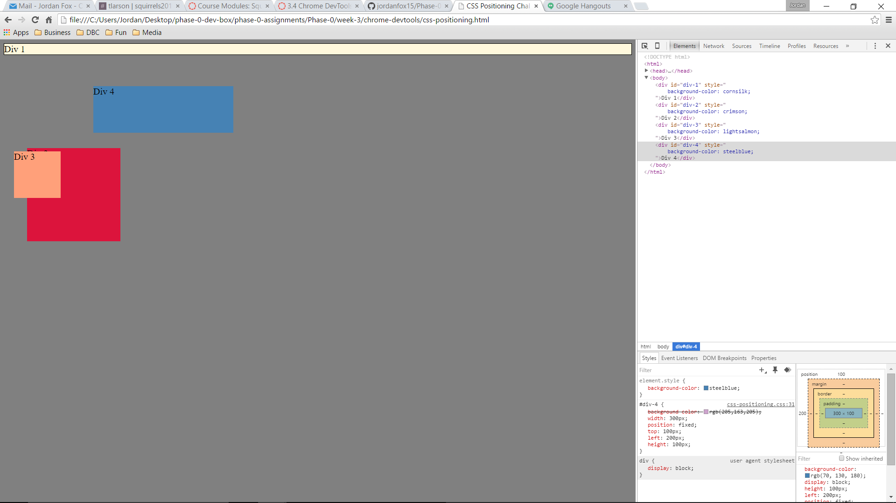
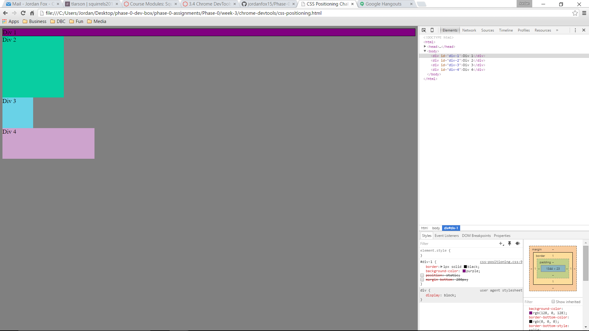
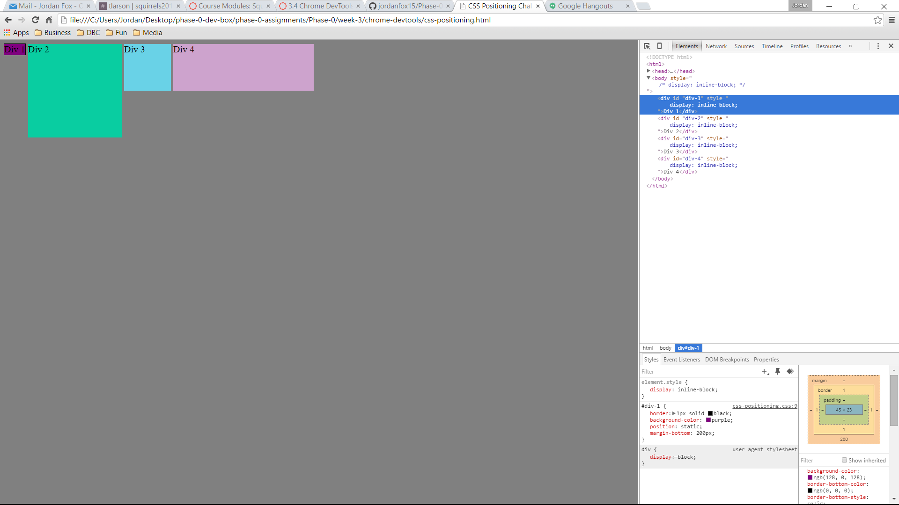
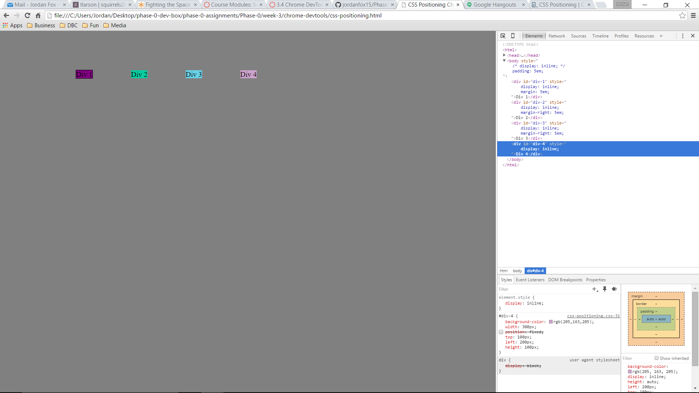
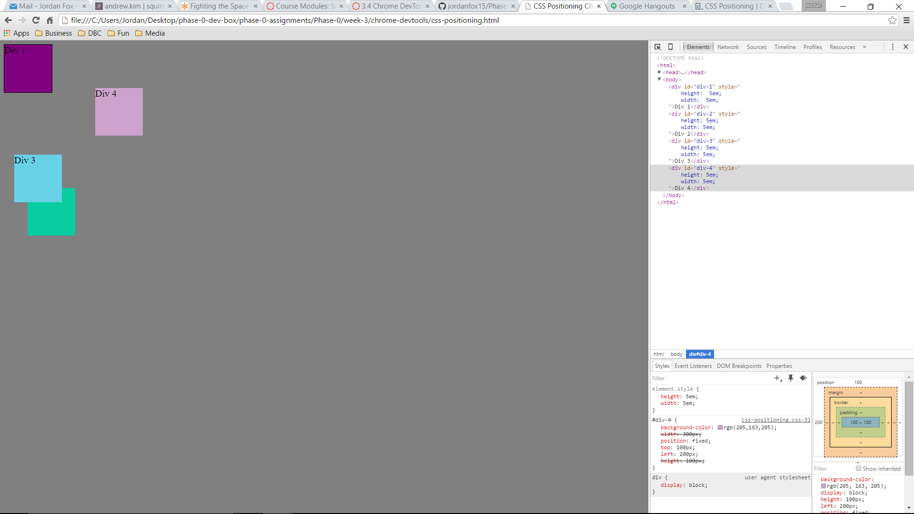
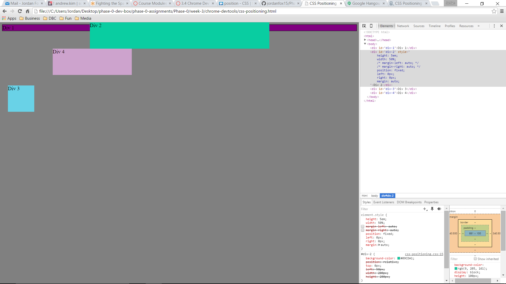
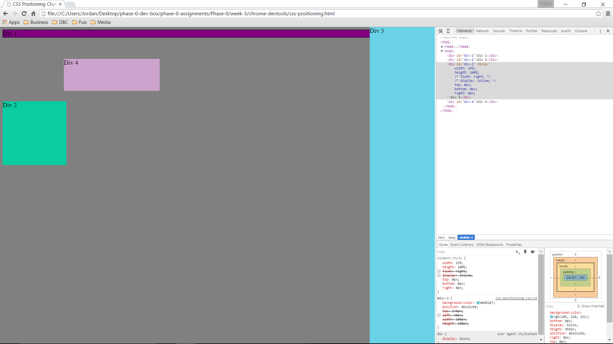
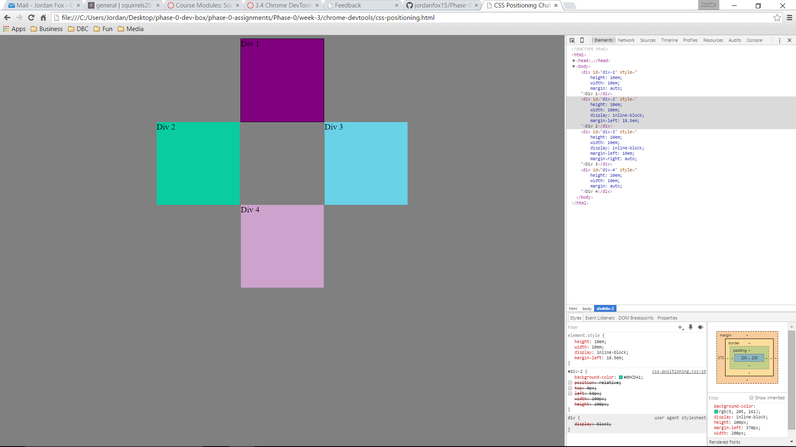

#How can you use Chrome's DevTools inspector to help you format or position elements?
The best thing I have found about Chrome's DevTools inspector is that you can make changes without affecting the source code and any formatting that is already placed you can check and uncheck to make it work and not make it work which helped a lot.
#How can you resize element on the DOM using CSS?
The easiest way I found was to use the Height and Width commands.
#What are the differences between absolute, fixed, static, and relative positioning?  Which did you find easiest to use?  Which was most difficult?
- Static position lays an element out in its current position in the flow.  The default setting for all elements.
- Fixed position tells an element where to go relative to the screen.  Even when you scroll it will always be on screen.
- Relative position will move an element in reference to its default position on the screen.
- Absolute position will lay out an element in reference to its nearest ancestor or block that does not have absolute position.
- The easiest for me was fixed.  I told it where it should be and it stayed there.  The most difficult was all the rest.  I still don't understand quite how all the positions work together practically, but I'm sure I will acquire a much understanding when I do the solo challenge.
#What are the differences between margin, border, and padding?
- Padding is the space between the center of an element and the border.  The border is the very edge of an element.  Margin is the space between the border of an element and the next closest element.
#What was your impression of this challenge overall? (love, hate, and why?)
- Annoying.  My partner and I found that it took A LOT of google to complete this challenge.  I have a better understanding of css which is the point so I am not complaining.  But hey, you asked.