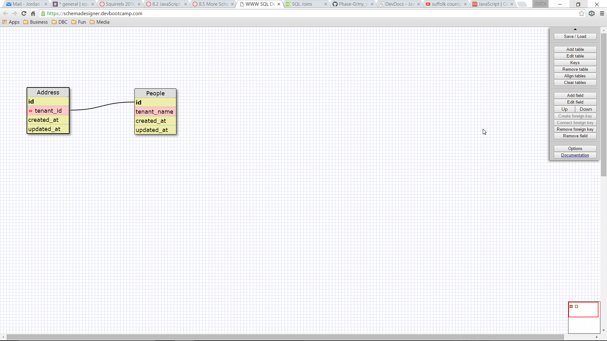
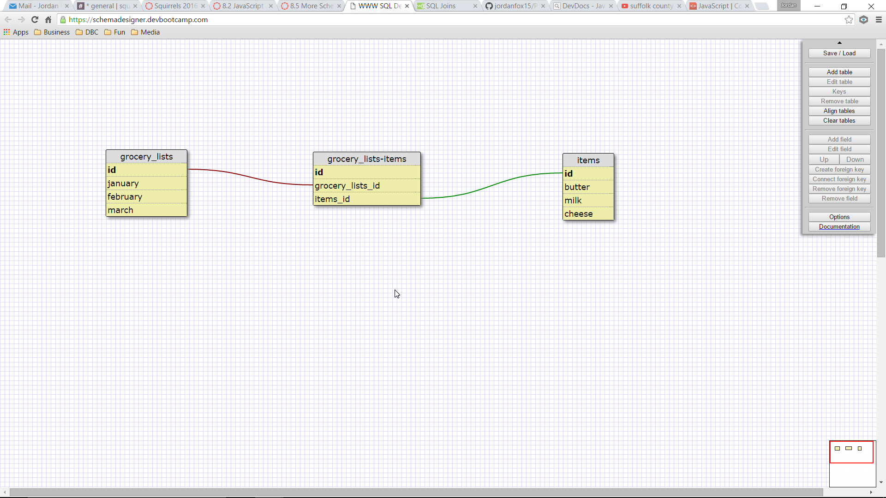

This is a 1 to 1 relationship because in my example an address only has 1 tenant and each person lives in only one address.

Reflections

What is a one-to-one database?
-2 databases where one entry in one of them is matched to one entry in the other and vice-versa.

When would you use a one-to-one database? (Think generally, not in terms of the example you created).
-If a group of fields can all optionally be set to null without breaking anything.

What is a many-to-many database?
-2 databases where many entries are matched to many entries in the other and vice-versa.

When would you use a many-to-many database? (Think generally, not in terms of the example you created).
-When you have many different groups where there are more then 1 entry can match more then one entry in the 2nd group.

What is confusing about database schemas? What makes sense?
-The schemas all make sense more or less.